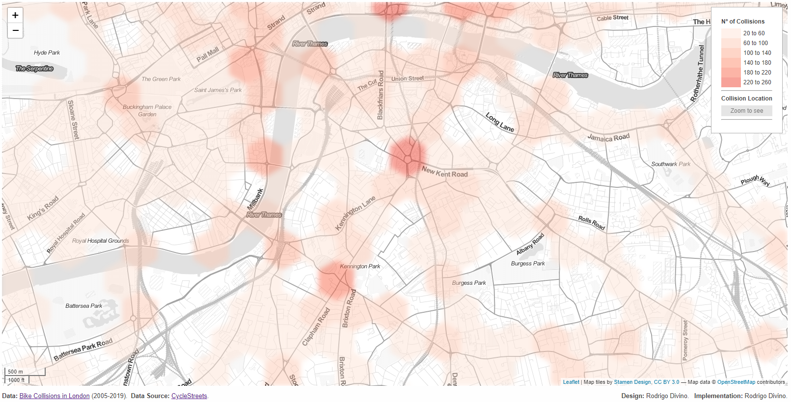
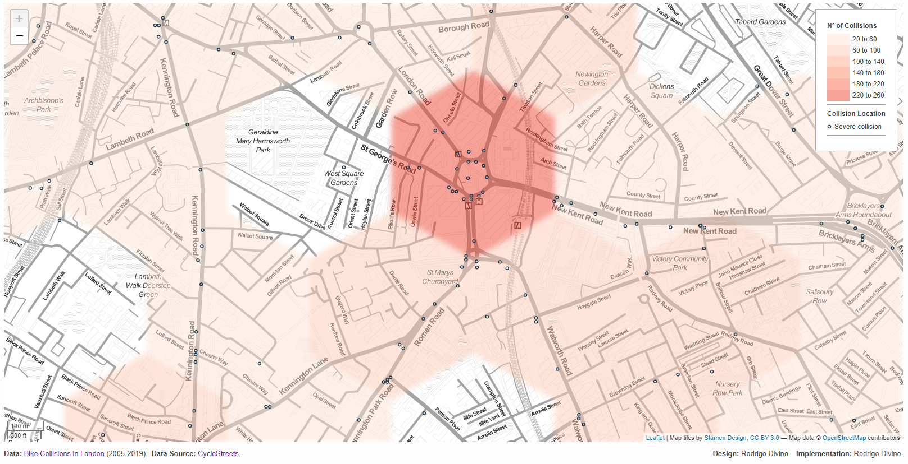

# A Data Visualization of the London Bicycle Collisions between 2005 and 2019.

The visualization can be accessed at [https://rodrigodivino.github.io/london-bike-collisions/](https://rodrigodivino.github.io/london-bike-collisions/).

This visualization shows the distribution of bicycle accidents in London between 2005 and 2019. It displays a map with a
hexagonal heatmap of the area, in which the color of the hexagons shows the number of collisions.

Zooming further the map also displays the locations of individual severe collisions,
as defined in the data.

The goal of the visualization is to identify dangerous locations where non-slight accidents are likely to occur,
bringing awareness of this information to cyclists in the area.

The number of casualties in the individual accidents and the exact severity of the collision
are not displayed in respect to the involved civilians.

# Data Source

The data in this visualization is from
[CycleStreets](https://bikedata.cyclestreets.net/collisions/#9.44/51.4814/0.0567). The data was a part of the
[Makeover Monday](https://www.makeovermonday.co.uk/data/) challenge
[in Week 31 2021](https://data.world/makeovermonday/2021w31).
